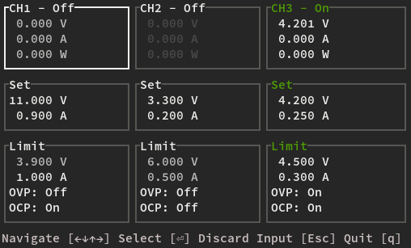

# DP800

[](https://github.com/newAM/dp800/actions)



A weekend project to build a TUI for my Rigol DP832 power supply.

There are two crates in this workspace:

- `dp800`: A rust interface for the DP800 series power supply
- `dp832`: A basic TUI for the Rigol DP832

## Configuration

The address of the power supply is configured with a file named `dp832.txt` in your [configuration directory].

This file must contain exactly one line with the address and port of the power supply's telnet interface, for example:

```txt
10.0.0.2:5555
```

[configuration directory]: https://docs.rs/dirs/6.0.0/dirs/fn.config_dir.html
